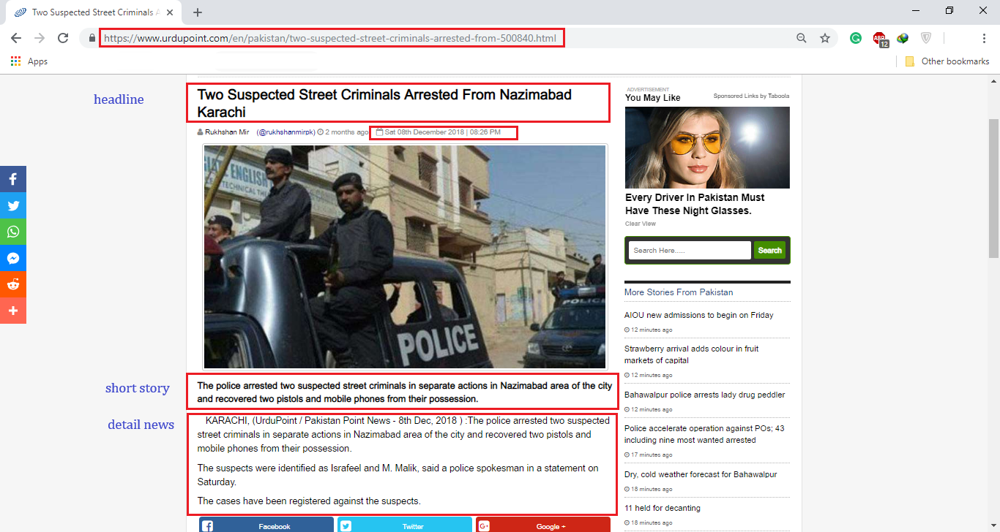

# News-Scrapper
This work is inspired from the book: "web scraping with python" (Ryan mitchell)
It requests the website and scraps news from different pages. It uses python beautiful-soup, and requests packages to scrap data.
the scraper scraps new from https://www.urdupoint.com/en/news/pakistan/crime-updates.html to different diserable number of news, for every news it scraps data of main-category's link, news orginal link, date, time, Headline, short descrpition, full-story description.

Scrapper file along with scraped dataset is available for you to download, pull, merge, and any suggestions are welcomed.

-> Connect with me @ https://www.linkedin.com/in/nauman-a-butt/
 
